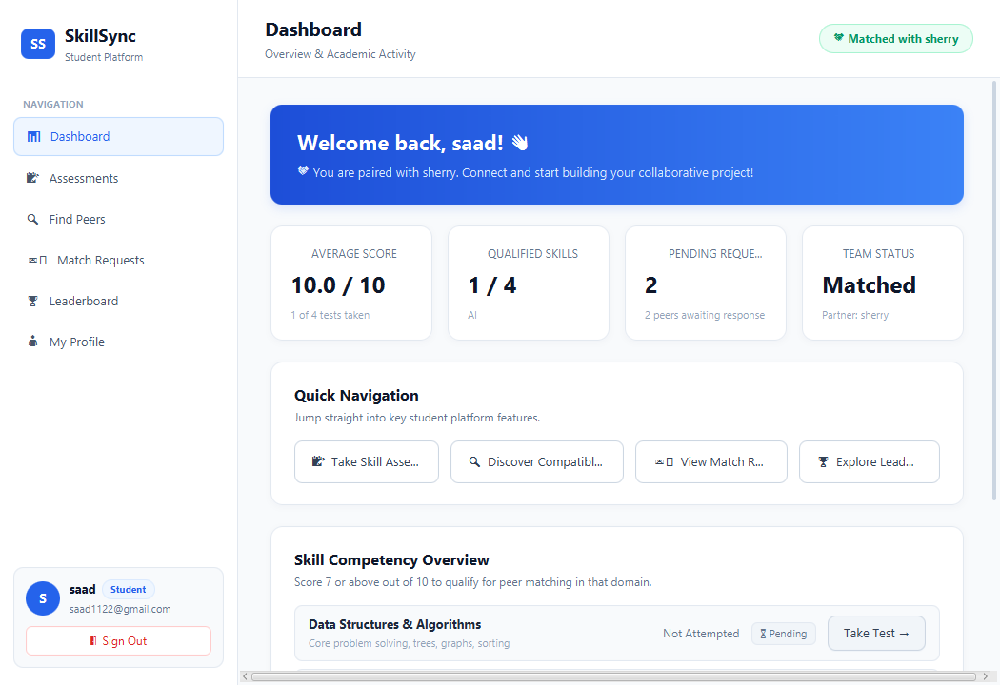
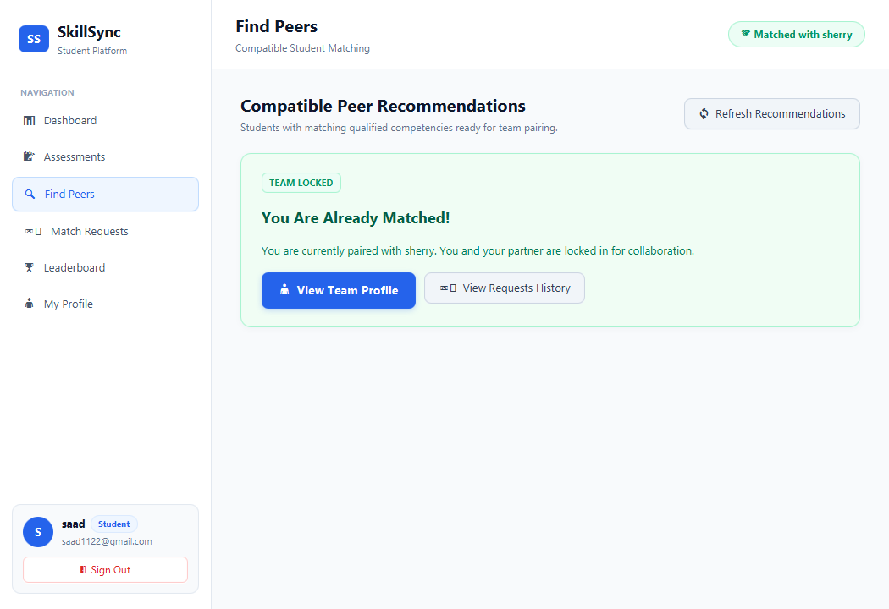
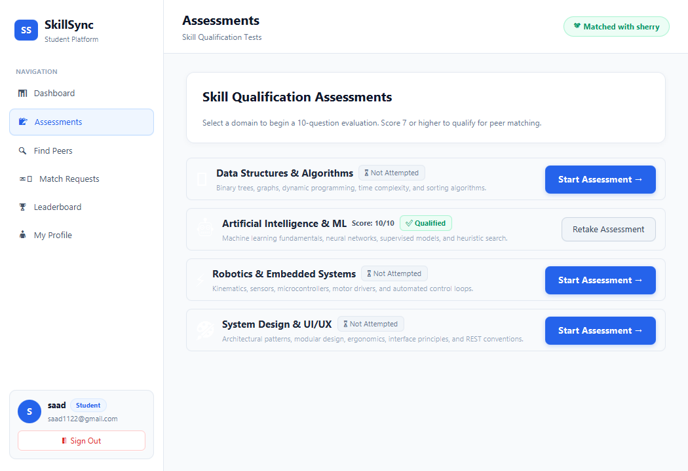
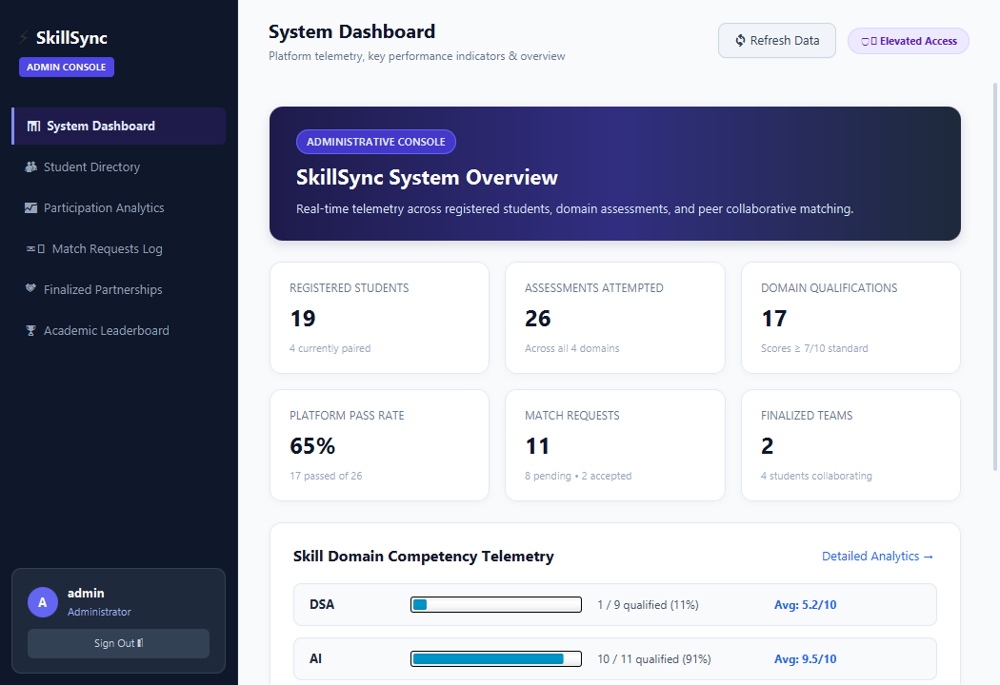
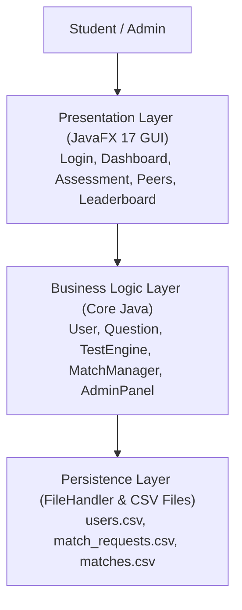
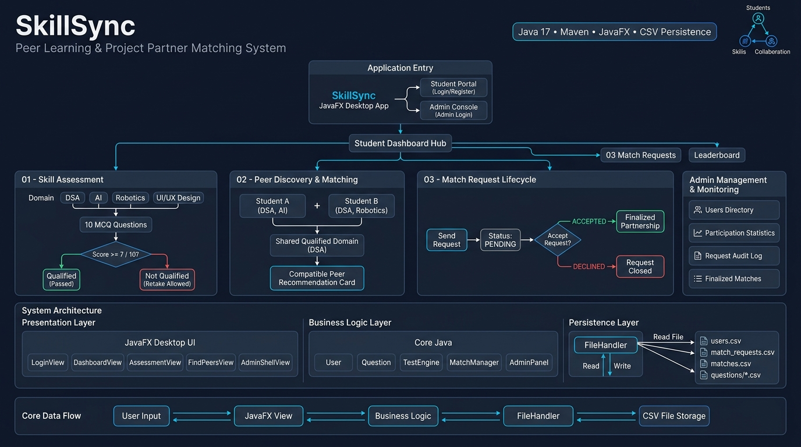

# SkillSync
> A peer-learning and project partner matching desktop application powered by core Data Structures and Algorithms.

<div align="center">

[](https://www.oracle.com/java/)
[](https://openjfx.io/)
[](https://maven.apache.org/)
[](LICENSE)
[](https://github.com/AmirSaad1417)

> **Academic Focus:** Data Structures & Algorithms (DSA)  
> **Course:** 3rd-Semester Computer Science / DSA Lab Project  
> **Repository:** [https://github.com/AmirSaad1417/SkillSync](https://github.com/AmirSaad1417/SkillSync)

</div>

---

## The Problem

Finding a suitable project partner at university can be frustrating and inefficient. 

Students often want to collaborate on semester coursework, hackathons, or capstone projects, but they rarely know the true strengths of their peers. Some students excel at Data Structures and Algorithms, while others are stronger in Artificial Intelligence, Robotics, or UI/UX Design. Relying on casual conversations or random group chats often leads to mismatched skills and unbalanced project teams.

---

## The Idea

**SkillSync** was developed as a 3rd-semester DSA project to solve this problem using **data structures, searching, set intersection, and comparator sorting**.

Instead of guessing someone's abilities, students take short objective assessments in specific skill domains. If a student passes with a score of **7 out of 10** or higher, that domain is marked as qualified. SkillSync then compares qualified domains across the student roster, identifies shared technical tracks, and ranks compatible peers so students can send teaming invitations and form verified partnerships.

The system was originally built around pure Java data structures and algorithmic workflows. A modern JavaFX desktop interface was later added to provide an intuitive, polished user experience.

---

## How It Works

```text
Student
   ↓
JavaFX Desktop UI
   ↓
Skill Assessment (10 MCQs)
   ↓
Score Evaluation (Score ≥ 7 / 10)
   ↓
Qualified Domains Set
   ↓
Peer Discovery & Intersection
   ↓
Comparator Ranking (Shared Interests)
   ↓
Match Request (Pending → Accepted / Declined)
   ↓
Finalized Partnership
   ↓
Atomic CSV Persistence
```

1. **Register / Login:** Authenticate into your local student profile.
2. **Take an Assessment:** Answer 10 randomized MCQs in DSA, AI, Robotics, or UI/UX Design.
3. **Earn Qualification:** Score **7 / 10** or higher to qualify for that skill domain.
4. **Discover Peers:** The system matches your qualified skills against other students.
5. **Send Match Request:** Select a shared technical track and send an invitation.
6. **Accept or Decline:** The recipient reviews incoming requests and decides to accept or decline.
7. **Finalized Partnership:** Once accepted, both students become paired teammates, visible across dashboards and profiles.

---

## Data Structures & Algorithms (DSA)

The core logic of SkillSync relies on classical data structures and algorithms implemented in standard Java.

### 1. Data Structures Used

| Data Structure | Implementation | Where It Is Used | Why It Was Chosen |
| :--- | :--- | :--- | :--- |
| **Hash Map** | `HashMap<String, Integer>` | `User.java` (`scores`) | Provides $O(1)$ amortized lookup and updates for individual domain test scores (`dsa`, `ai`, `robotics`, `design`). |
| **Object Cache** | `HashMap<String, List<Question>>` | `FileHandler.java` (`questionCache`) | Memoizes question banks in memory after first CSV read, avoiding redundant disk I/O. |
| **Dynamic Array** | `ArrayList<User>` | `FileHandler.java`, `SkillSyncApp.java` | Efficient indexed storage for the student roster, enabling linear scans and stream-based filtering. |
| **Dynamic Array** | `ArrayList<Question>` | `TestEngine.java`, `Question.java` | Stores question banks loaded from CSV, supporting in-place shuffling and sublist windowing. |
| **List** | `List<String>` | `User.java` (`getQualifiedInterests`) | Dynamically collects qualified domain names for set comparison. |
| **State Machine Record** | `MatchRequest` (inner class) | `MatchManager.java` | Encapsulates request state transitions (`PENDING`, `ACCEPTED`, `DECLINED`). |

---

### 2. Algorithms Used

| Algorithm / Operation | Where It Is Used | How It Works | Time Complexity |
| :--- | :--- | :--- | :---: |
| **Fisher-Yates Shuffle** | `TestEngine.conductTest` (`Collections.shuffle`) | Randomly permutes the domain question pool in-place to ensure each test attempt receives a unique question order. | $O(Q)$ |
| **Set Intersection** | `MatchManager.countSharedInterests` | Compares two students' qualified domain lists: $\text{Interests}(A) \cap \text{Interests}(B)$ to quantify shared technical competency. | $O(k)$ |
| **Filtering Predicate** | `MatchManager.findBestMatches` | Scans the student roster via linear search, filtering out the current user and students who are already paired. | $O(N)$ |
| **Comparator Ranking** | `MatchManager.findBestMatches` (`List.sort`) | Sorts candidate peers in descending order based on the count of shared qualified domains using Timsort. | $O(M \log M)$ |
| **Top-K Windowing** | `MatchManager.findBestMatches` (`subList`) | Extracts the top 5 most compatible candidate profiles from the sorted recommendation list. | $O(1)$ |
| **Multi-Criteria Sorting** | `LeaderboardView.java`, `User.java` | Sorts students by total qualified domain count descending, then by average score descending, and alphabetically by username. | $O(N \log N)$ |
| **Linear Search** | `FileHandler.java`, `LoginView.java` | Performs case-insensitive matching to verify credentials and detect duplicate registrations. | $O(N)$ |
| **Atomic Replacement** | `FileHandler.saveUsers` | Writes data to a temporary `.tmp` file and replaces the destination file atomically (`StandardCopyOption.REPLACE_EXISTING`) to prevent corrupted records. | $O(N)$ |

*Note: $N$ = total registered students, $M$ = eligible candidate students ($M \le N$), $Q$ = question pool size ($Q \approx 10\text{--}20$), $k$ = number of domains ($k \le 4$).*

---

### 3. Complexity Overview

| System Operation | Target Class | Time Complexity | Auxiliary Space |
| :--- | :--- | :---: | :---: |
| **Student Credential Lookup** | `FileHandler` / `LoginView` | $O(N)$ | $O(1)$ |
| **Domain Score Access** | `User.getScore` | $O(1)$ | $O(1)$ |
| **Qualification Check** | `User.isQualified` | $O(1)$ | $O(1)$ |
| **Question Shuffling & Selection** | `TestEngine.conductTest` | $O(Q)$ | $O(1)$ |
| **Candidate Peer Matching** | `MatchManager.findBestMatches` | $O(N + M \log M)$ | $O(M)$ |
| **Leaderboard Ranking** | `LeaderboardView` | $O(N \log N)$ | $O(N)$ |
| **CSV Full State Save** | `FileHandler.saveUsers` | $O(N)$ | $O(N)$ |

---

### 4. DSA Concept Architecture

```text
                    SkillSync DSA Core
                             │
              ┌──────────────┼──────────────┐
              │              │              │
        Data Structures  Algorithms    Complexity
              │              │              │
           HashMap        Shuffling       O(1)
          ArrayList      Intersection     O(N)
         State Records     Timsort     O(N log N)
              │              │
              └──────────────┼──────────────┘
                             │
                      System Features
                             │
              ┌──────────────┼──────────────┐
              ▼              ▼              ▼
         Assessment    Peer Matching   Leaderboard
       (Randomized)   (Set Overlap)   (Comparator)
```

---

## Screenshots

<div align="center">

### Student Dashboard

*Personal competency metrics, qualification badges, and quick action shortcuts.*

<br>

### Peer Discovery & Matching

*Ranks peers by shared qualified skill domains ($\text{Skills}_A \cap \text{Skills}_B$).*

<br>

### Skill Assessment

*Randomized 10-MCQ testing with score-based qualification ($7/10$).*

<br>

### Admin Management & Monitoring

*Administrative telemetry: live student directory, participation statistics, and audit logs.*

</div>

---

## System Architecture

SkillSync follows a clean **Three-Tier Desktop Architecture**:





For a complete architectural specification with UML state machines and data flow pipelines, see **[docs/ARCHITECTURE_AND_WORKFLOW.md](docs/ARCHITECTURE_AND_WORKFLOW.md)**.

---

## Built With

- **Java 17 (LTS)** — Core programming language, collections framework, and algorithms
- **JavaFX 17** — Modern hardware-accelerated desktop UI and CSS styling
- **Apache Maven** — Build automation, testing, and dependency management
- **Flat CSV Storage** — Human-readable, crash-resilient local persistence

---

## Project Structure

```text
SkillSync/
├── pom.xml                           # Maven project configuration
├── README.md                         # Project documentation
├── LICENSE                           # Open-source MIT license
├── .gitignore                        # Git exclusion rules
├── run-gui.bat                       # 1-Click desktop launcher (Windows)
├── test-suite.bat                    # Automated verification test suite
│
├── src/
│   ├── main/
│   │   ├── java/com/skillsync/
│   │   │   ├── AppLauncher.java      # Application startup entry point
│   │   │   ├── SkillSyncApp.java     # JavaFX lifecycle & window router
│   │   │   ├── User.java             # Student profile & HashMap scores model
│   │   │   ├── Question.java         # Immutable MCQ entity
│   │   │   ├── TestEngine.java       # Quiz shuffling & grading engine
│   │   │   ├── MatchManager.java     # Peer matching & comparator ranking
│   │   │   ├── AdminPanel.java       # System telemetry & analytics
│   │   │   ├── FileHandler.java      # Atomic CSV reader & writer
│   │   │   └── ui/                   # JavaFX view components
│   │   │       ├── LoginView.java
│   │   │       ├── RegisterView.java
│   │   │       ├── MainShellView.java
│   │   │       ├── DashboardView.java
│   │   │       ├── ProfileView.java
│   │   │       ├── AssessmentView.java
│   │   │       ├── AssessmentResultView.java
│   │   │       ├── FindPeersView.java
│   │   │       ├── RequestsView.java
│   │   │       ├── LeaderboardView.java
│   │   │       └── AdminShellView.java
│   │   └── resources/
│   │       ├── styles/skillsync.css  # Modern desktop stylesheet
│   │       └── questions/            # MCQ datasets (DSA, AI, Robotics, Design)
│   └── test/java/com/skillsync/ui/   # 4 automated test suites
│
├── docs/                             # Documentation and visual assets
│   ├── ARCHITECTURE_AND_WORKFLOW.md  # Detailed architecture specification
│   ├── INFOGRAPHIC.html              # Standalone interactive presentation poster
│   └── images/                       # Screenshots and architecture diagrams
│
├── users.csv                         # Local student database
├── match_requests.csv                # Partner requests log
└── matches.csv                       # Finalized student teams log
```

---

## Getting Started

### Prerequisites
- **Java Development Kit (JDK) 17** or higher
- **Apache Maven 3.8+** (or use the built-in Maven in IntelliJ IDEA / Eclipse)

### Option 1: 1-Click Run (Windows)
Double-click **`run-gui.bat`** in the project root. It will resolve JavaFX dependencies and launch the application immediately.

### Option 2: Run with Maven
```bash
git clone https://github.com/AmirSaad1417/SkillSync.git
cd SkillSync
mvn clean compile
mvn javafx:run
```

### Option 3: Run in IntelliJ IDEA
1. Open IntelliJ IDEA and choose **File $\rightarrow$ Open**.
2. Select the `SkillSync` project folder (where `pom.xml` is located).
3. If prompted, select **Trust Project** and let Maven sync dependencies.
4. Navigate to `src/main/java/com/skillsync/AppLauncher.java`.
5. Click the green **Run ▶️** button next to `main`.

---

## Demo Accounts

| Role | Username / Email | Password | Details |
| :--- | :--- | :--- | :--- |
| **Administrator** | `admin` | `admin123` | Full access to Admin Console, student directory, and reports |
| **Matched Student** | `saad123@gmail.com` | `123456` | Example student already paired for Artificial Intelligence |
| **Available Student** | `abbas1122@gmail.com` | `123456` | Qualified in AI, available to send and receive match requests |
| **New Student** | *Sign up on Login Screen* | *Custom* | Start fresh, take an assessment, and qualify for matches |

---

## Project Background

SkillSync began as a **3rd-Semester Computer Science / Data Structures & Algorithms Lab university project**. 

The goal was to demonstrate practical applications of basic data structures (`HashMap`, `ArrayList`, sets, arrays) and algorithms (filtering, set intersection, in-place shuffling, and multi-field comparator sorting) to solve a real campus problem: finding project teammates based on verified competencies. The project was later enhanced with a modern JavaFX desktop interface to make it user-friendly while preserving its underlying algorithmic foundation.

---

## Scope & Limitations

SkillSync was built for an academic university context, so it has some intentional design boundaries:
- **Offline / Local Desktop App:** The application runs locally on a single machine; it does not connect to a cloud database or remote web server.
- **CSV Data Storage:** Data is stored in local `.csv` files rather than a SQL database, keeping the project lightweight and simple to run without installing database services.
- **Academic Authentication:** Passwords are stored locally for project demonstration purposes. In a production web application, industry-standard salted hashing (e.g., BCrypt) would be required.

---

## Future Ideas

- [ ] Connect to an external database (such as SQLite or PostgreSQL)
- [ ] Add in-app direct messaging between paired project partners
- [ ] Support custom project postings with team size limits
- [ ] Add student portfolio links (GitHub profile, LinkedIn, project showcase)
- [ ] Export completed partnership certificates as PDF

---

## License

This project is licensed under the [MIT License](LICENSE). You are free to use, study, and modify it for educational purposes.
