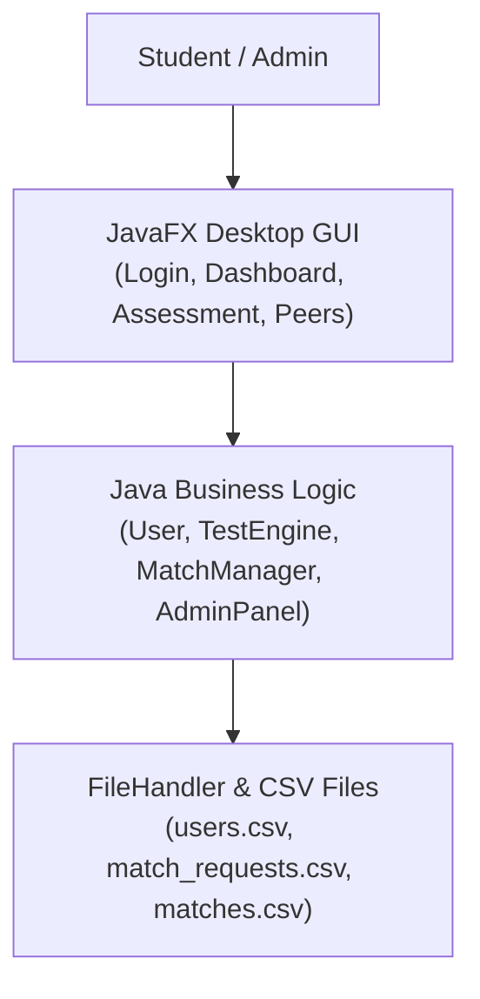

# SkillSync
> A peer-learning and project partner matching desktop app for computer science students.

---

## The Idea

Finding the right project partner at university can be difficult. 

Students often want to team up for semester projects, hackathons, or study groups, but they usually don't know who has the skills they need. Some students are great at Data Structures and Algorithms, while others excel in Artificial Intelligence, Robotics, or UI/UX Design.

**SkillSync** was created to solve this problem. 

Instead of guessing someone's skills or asking around in group chats, students take short skill assessments directly inside the app. If a student passes a domain test, that skill is marked as qualified. SkillSync then finds other students who share the same qualified interests and helps them connect, send partnership requests, and form project teams.

---

## How It Works

The workflow is simple and straightforward:

1. **Sign Up or Log In:** Create an account with your username, email, and password.
2. **Take a Skill Assessment:** Answer 10 multiple-choice questions in one of four tracks:
   - Data Structures & Algorithms (DSA)
   - Artificial Intelligence (AI)
   - Robotics
   - UI/UX Design
3. **Get Qualified:** Score **7 out of 10** or higher to earn a qualified domain badge.
4. **Discover Compatible Peers:** Open *Find Peers* to view students who share your qualified domains.
5. **Send a Match Request:** Choose a skill track and send an invitation to team up.
6. **Accept or Decline:** The recipient can accept the invitation or decline it.
7. **Finalized Partnership:** When accepted, both students are paired together and their profiles show their new project teammate.

---

## Screenshots

<div align="center">

### Student Dashboard

*Track your domain competency, assessment scores, and team status at a glance.*

<br>

### Peer Discovery & Matching

*Find students who share your qualified skill tracks and send partnership requests.*

<br>

### Skill Assessment

*Take 10 randomized multiple-choice questions to prove your skills and earn qualification.*

<br>

### Admin Management & Monitoring

*View platform statistics, all registered students, request audit logs, and finalized partnerships.*

</div>

---

## System Flow & Architecture

SkillSync is designed as a classic **Three-Tier Desktop Application**:




For a complete deep-dive with formal diagrams, state machines, and data pipelines, see **[docs/ARCHITECTURE_AND_WORKFLOW.md](docs/ARCHITECTURE_AND_WORKFLOW.md)**.

---

## Main Features

- **Interactive Multiple-Choice Quizzes:** Randomized 10-question tests with immediate scoring and review.
- **Competency Qualification:** A clear standard of **7 / 10** required for domain certification.
- **Smart Peer Recommendation:** Automatically filters out already-paired students and ranks candidate peers by shared qualified skills.
- **Complete Request Lifecycle:** Transparent `Pending` $\rightarrow$ `Accepted` or `Declined` teaming invitations.
- **Student Leaderboard:** Podium rankings (🥇 Gold, 🥈 Silver, 🥉 Bronze), domain count badges, and student search.
- **Administrator Console:** Live telemetry for student rosters, pass rates, match logs, and confirmed teams.
- **Crash-Resilient CSV Storage:** Atomic temporary file writes (`.tmp` $\rightarrow$ `.csv`) guarantee zero data corruption.

---

## Built With

- **Java 17 (LTS)** — Modern core object-oriented programming
- **JavaFX 17** — Hardware-accelerated desktop user interface and custom CSS styling
- **Apache Maven** — Dependency and build lifecycle management
- **Flat CSV Persistence** — Lightweight, human-readable data storage without SQL or database setup

---

## Project Structure

```text
SkillSync/
├── pom.xml                           # Maven project configuration
├── README.md                         # Project documentation
├── LICENSE                           # Open-source MIT license
├── .gitignore                        # Git exclusion rules
├── run-gui.bat                       # 1-Click desktop launcher (Windows)
├── test-suite.bat                    # Automated verification test suite
│
├── src/
│   ├── main/
│   │   ├── java/com/skillsync/
│   │   │   ├── AppLauncher.java      # Application startup entry point
│   │   │   ├── SkillSyncApp.java     # JavaFX lifecycle & window router
│   │   │   ├── User.java             # Student profile and score data model
│   │   │   ├── Question.java         # Multiple-choice question entity
│   │   │   ├── TestEngine.java       # Quiz shuffling and grading logic
│   │   │   ├── MatchManager.java     # Peer recommendation and request workflow
│   │   │   ├── AdminPanel.java       # Platform analytics and reports
│   │   │   ├── FileHandler.java      # Atomic CSV file reader and writer
│   │   │   └── ui/                   # JavaFX view components
│   │   │       ├── LoginView.java
│   │   │       ├── RegisterView.java
│   │   │       ├── MainShellView.java
│   │   │       ├── DashboardView.java
│   │   │       ├── ProfileView.java
│   │   │       ├── AssessmentView.java
│   │   │       ├── AssessmentResultView.java
│   │   │       ├── FindPeersView.java
│   │   │       ├── RequestsView.java
│   │   │       ├── LeaderboardView.java
│   │   │       └── AdminShellView.java
│   │   └── resources/
│   │       ├── styles/skillsync.css  # Modern desktop stylesheet
│   │       └── questions/            # Question banks for each skill track
│   └── test/java/com/skillsync/ui/   # Automated headless UI test suites
│
├── docs/                             # Documentation and visual assets
│   ├── ARCHITECTURE_AND_WORKFLOW.md  # Detailed architecture specification
│   ├── INFOGRAPHIC.html              # Standalone interactive presentation poster
│   └── images/                       # Screenshots and architecture diagrams
│
├── users.csv                         # Local student database
├── match_requests.csv                # Partner requests log
└── matches.csv                       # Finalized student teams log
```

---

## Getting Started

### Prerequisites
- **Java Development Kit (JDK) 17** or higher
- **Apache Maven 3.8+** (or use the built-in Maven in IntelliJ IDEA / Eclipse)

### Option 1: 1-Click Run (Windows)
Double-click **`run-gui.bat`** in the project root. It will automatically resolve JavaFX dependencies and launch the application window.

### Option 2: Run with Maven
Clone the repository and run:
```bash
git clone https://github.com/your-username/SkillSync.git
cd SkillSync
mvn clean compile
mvn javafx:run
```

### Option 3: Run in IntelliJ IDEA
1. Open IntelliJ IDEA and choose **File $\rightarrow$ Open**.
2. Select the `SkillSync` project folder (where `pom.xml` is located).
3. If prompted, select **Trust Project** and let Maven sync dependencies.
4. Navigate to `src/main/java/com/skillsync/AppLauncher.java`.
5. Click the green **Run ▶️** button next to `main`.

---

## Demo Accounts

You can test the application right away using these preloaded accounts:

| Role | Username / Email | Password | Details |
| :--- | :--- | :--- | :--- |
| **Administrator** | `admin` | `admin123` | Full access to Admin Console, student directory, and reports |
| **Matched Student** | `saad123@gmail.com` | `123456` | Example student already paired for Artificial Intelligence |
| **Available Student** | `abbas1122@gmail.com` | `123456` | Qualified in AI, available to send and receive match requests |
| **New Student** | *Sign up on Login Screen* | *Custom* | Start fresh, take an assessment, and qualify for matches |

---

## Project Background

SkillSync began as a **3rd-Semester Computer Science / Data Structures & Algorithms Lab university project**. 

The goal was to build a working, object-oriented system that could solve a practical campus problem: finding project partners based on proven technical skills. It was later expanded from its initial command-line interface into a full modern JavaFX desktop application with dedicated student and administrator experiences.

---

## Scope & Limitations

SkillSync was built for an academic university context, so it has some intentional design boundaries:
- **Offline / Local Desktop App:** The application runs locally on a single machine; it does not connect to a cloud database or remote web server.
- **CSV Data Storage:** Data is stored in local `.csv` files rather than a SQL database, keeping the project lightweight and simple to run without installing database services.
- **Academic Authentication:** Passwords are stored locally for project demonstration purposes. In a real-world production web app, industry-standard salted hashing (e.g., BCrypt) would be required.

---

## Future Ideas

- [ ] Connect to an external database (such as SQLite or PostgreSQL)
- [ ] Add in-app direct messaging between paired project partners
- [ ] Support custom project postings with team size limits
- [ ] Add student portfolio links (GitHub profile, LinkedIn, project showcase)
- [ ] Export completed partnership certificates as PDF

---

## License

This project is licensed under the [MIT License](LICENSE). You are free to use, study, and modify it for educational purposes.
