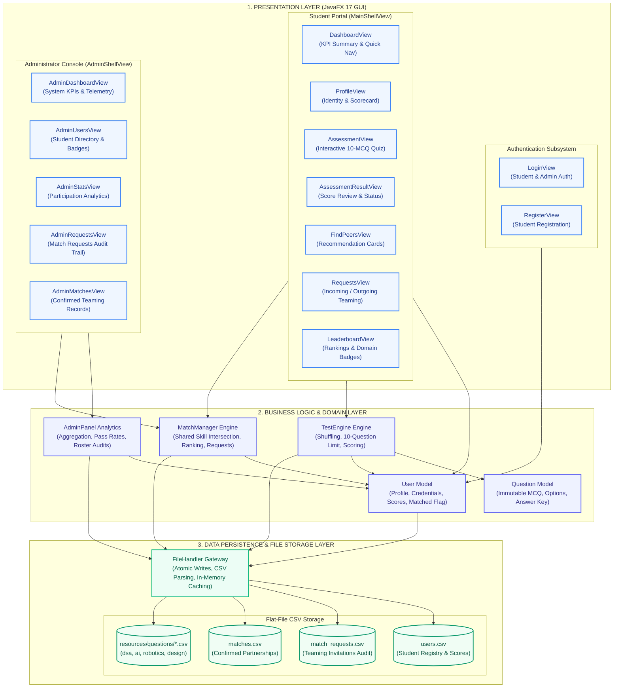
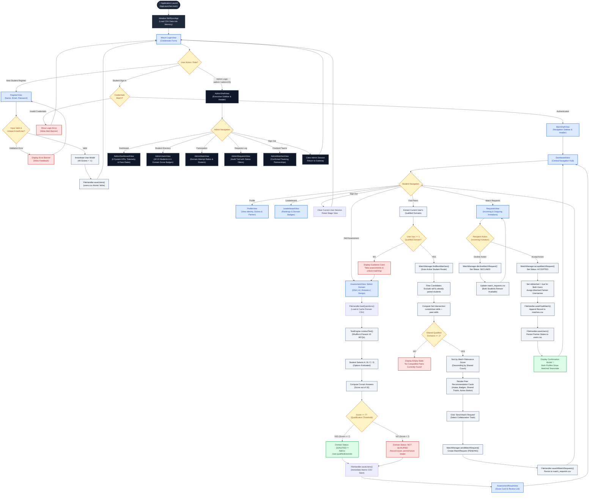

# SkillSync — System Architecture & Workflow Specification
> **Document Status:** Complete & Verified Baseline  
> **Target Audience:** System Architects, Examiners, Technical Evaluators, Peer Collaborators  
> **Platform:** Java 17 LTS • JavaFX Desktop GUI • Apache Maven • Flat CSV Persistence  

---

## 1. Executive Summary

**SkillSync** is a dedicated university peer-learning and project partner matching desktop application. It evaluates students' technical competencies through objective, domain-specific multiple-choice assessments and algorithmically pairs students based on the intersection of their qualified technical domains.

The system is engineered as an **offline-first desktop software application** following a strict **Three-Tier Architecture**:
1. **Presentation Layer (JavaFX 17 GUI):** Declarative controllers, reactive scene routing, component-based view layouts, and customized CSS styling.
2. **Business Logic Layer (Core Domain & Algorithms):** Domain models, assessment scoring engines, threshold qualification checks, compatibility intersection ranking, and administrative analytics.
3. **Data / Persistence Layer (FileHandler & Flat CSV Storage):** Thread-safe file I/O with crash-resilient **atomic temporary-file replacement** (`.tmp` $\rightarrow$ `.csv`) for zero data loss.

---

## 2. High-Level System Architecture (Three-Tier Desktop Model)



---

## 2. End-to-End System Workflow Diagram

This master diagram details the exact path of execution from initial process launch through authentication, student actions, assessment scoring, peer recommendation, teaming lifecycle, and admin oversight.



---

## 3. Bi-Directional Core Data Flow Pipeline

The application features a strict, predictable data flow pipeline that separates presentation event handling from business logic calculations and disk serialization.

```mermaid
flowchart LR
    subgraph WRITE_PIPELINE ["WRITE PIPELINE (Mutation & Persistence)"]
        direction LR
        U_IN["1. User Interaction\n(Button click, MCQ option, Form submit)"] -->
        V_EVT["2. JavaFX View\n(Input sanitization & Event handler)"] -->
        B_OP["3. Business Logic\n(Scoring, Matching, Status mutation)"] -->
        V_VAL{"4. Validation\n(Rules, duplicates, delimiters)"} -->|Passed|
        F_WR["5. FileHandler Gateway\n(Atomic file serialization)"] -->
        C_DISK[("6. CSV File Storage\n(.tmp -> atomic rename)")]
    end

    subgraph READ_PIPELINE ["READ PIPELINE (Hydration & Rendering)"]
        direction RL
        V_DISP["11. Rendered JavaFX View\n(Cards, Badges, Tables, Charts)"] <--
        O_LIST["10. Observable Java Collections\n(ObservableList, Binding properties)"] <--
        D_OBJ["9. Domain Object Models\n(User, Question, MatchRequest)"] <--
        P_PARSE["8. FileHandler CSV Parser\n(Header-aware, delimiter splitting)"] <--
        C_SRC[("7. CSV File on Disk\n(users, questions, requests, matches)")]
    end

    classDef writeNode fill:#eff6ff,stroke:#2563eb,stroke-width:1.5px,color:#1e3a8a;
    classDef readNode fill:#f0fdf4,stroke:#16a34a,stroke-width:1.5px,color:#14532d;
    classDef diskNode fill:#fef3c7,stroke:#d97706,stroke-width:2px,color:#78350f;

    class U_IN,V_EVT,B_OP,V_VAL,F_WR writeNode;
    class V_DISP,O_LIST,D_OBJ,P_PARSE readNode;
    class C_DISK,C_SRC diskNode;
```

### Pipeline Guarantees
1. **Delimiter Injection Defense:** All user inputs (names, credentials, messages) reject commas (`,`), preventing CSV row corruption.
2. **Crash-Resilient Atomic Writes:** Saves write to a temporary file (`.tmp`) first, followed by `Files.move(..., StandardCopyOption.REPLACE_EXISTING)`. If the JVM terminates mid-write, original data files remain uncorrupted.
3. **In-Memory Question Caching:** Question banks are parsed from CSV on first access and cached in memory, eliminating redundant disk reads during quizzes.

---

## 4. Match Request Lifecycle State Machine

The interaction between two students follows a formal deterministic finite state machine:

```mermaid
stateDiagram-v2
    [*] --> AVAILABLE : Student Registers or Unpaired
    
    state AVAILABLE {
        [*] --> Unqualified : No assessments passed
        Unqualified --> Qualified : Score >= 7 in >= 1 Domain
        Qualified --> Searching : Open 'Find Peers'
    }

    Searching --> PENDING : Student A sends Match Request to Student B
    
    state PENDING {
        note right of PENDING
            Stored in match_requests.csv
            Sender: Student A
            Recipient: Student B
            Track: Shared qualified interest
            Status: PENDING
        end note
    }

    PENDING --> DECLINED : Student B declines invitation
    DECLINED --> AVAILABLE : Request archived, both students free to pair
    
    PENDING --> ACCEPTED : Student B accepts invitation
    
    state ACCEPTED {
        note right of ACCEPTED
            1. Status updated in match_requests.csv
            2. Match pair written to matches.csv
            3. Both users flagged isMatched = true
            4. Partner names linked in users.csv
        end note
    }

    ACCEPTED --> FINALIZED_PARTNERSHIP : Mutual pairing committed
    
    state FINALIZED_PARTNERSHIP {
        [*] --> ActiveCollaboration
        ActiveCollaboration --> ExcludedFromSearch : Filtered from Find Peers
        ActiveCollaboration --> DisplayPartnerBadge : Visible in Dashboard & Profile
    }
```

---

## 5. Architectural Decision Matrix (Evaluation & Defense Guide)

This section provides technical justifications for why specific design patterns were chosen, ideal for project defense and technical viva:

| Architectural Component | Technical Choice | Alternatives Considered | Engineering Rationale |
| :--- | :--- | :--- | :--- |
| **GUI Framework** | **JavaFX 17 LTS** | Swing, AWT, Web Electron | Modern hardware-accelerated rendering pipeline, clean separation of CSS styling from layout nodes, native scene graphs, and zero web engine RAM overhead. |
| **Application Architecture** | **Three-Tier Desktop** | MVC with Spring Boot, Client-Server | Keeps the university project fully self-contained with zero server infrastructure, instant zero-latency startup, and predictable offline behavior. |
| **Data Persistence** | **Flat CSV + Atomic `.tmp` Replace** | SQLite, H2, JSON, XML | Human-readable flat storage meeting DSA Lab curriculum requirements, zero external native binaries, with enterprise-grade crash resilience via atomic renaming. |
| **Matching Engine** | **Set-Theoretic Domain Intersection** | Machine Learning, Cosine Vector Distance | Completely deterministic, transparent, and explainable to academic evaluators; precisely targets shared competency rather than opaque probabilistic guesses. |
| **Non-Modular Launcher** | **`AppLauncher` Bootstrap** | Modular `module-info.java` | Avoids complex modular reflection barriers when loading JavaFX controls and CSS across different IDE configurations and operating systems. |

---

## 6. Component & File Reference Map

```text
SkillSync Project Structure
├── src/main/java/com/skillsync/
│   ├── AppLauncher.java          # JVM Bootstrap entrypoint (bypasses module flags)
│   ├── SkillSyncApp.java         # Core JavaFX Application, stage manager & router
│   ├── User.java                 # Domain entity: credentials, 4-domain scores, matched flag
│   ├── Question.java             # Immutable domain entity: question text, options, answer key
│   ├── TestEngine.java           # Shuffles question pool, administers 10-MCQ tests, calculates scores
│   ├── MatchManager.java         # Candidate filtering, domain intersection, request state machine
│   ├── AdminPanel.java           # Telemetry computation, pass rates, and roster aggregation
│   ├── FileHandler.java          # Thread-safe CSV read/write operations with atomic replacement
│   └── ui/
│       ├── LoginView.java        # Modern split authentication card with student/admin switching
│       ├── RegisterView.java     # Student onboarding with duplicate & delimiter validation
│       ├── MainShellView.java    # Student workspace shell (sidebar navigation + dynamic header)
│       ├── DashboardView.java    # Student portal home: KPI cards, competency summary, shortcuts
│       ├── ProfileView.java      # Student scorecard, academic standings, and active partner card
│       ├── AssessmentView.java   # Domain selector, question cards, option pills, progress indicator
│       ├── AssessmentResultView.java # Celebratory score breakdown with detailed answer review
│       ├── FindPeersView.java    # Dynamic recommendation cards with shared qualified domain chips
│       ├── RequestsView.java     # Teaming management: incoming/outgoing review with Accept/Decline
│       ├── LeaderboardView.java  # Podium rankings, domain chips, live search, and sorting
│       ├── AdminSection.java     # Navigation route enum for administrator portal
│       ├── AdminShellView.java   # Executive dark slate shell with security badges and refresh action
│       ├── AdminDashboardView.java # 6 live system KPIs and 4-domain telemetry charts
│       ├── AdminUsersView.java   # Student directory table with 4-domain score badges
│       ├── AdminStatsView.java   # Domain attempt metrics, pass percentages, and roster tables
│       ├── AdminRequestsView.java# Peer invitation audit trail with status filters (Pending/Accepted/Declined)
│       └── AdminMatchesView.java # Confirmed student partnerships showcase
├── src/main/resources/
│   ├── styles/skillsync.css      # Desktop stylesheet (custom scrollbars, badges, buttons, cards)
│   └── questions/                # Assessment question banks
│       ├── dsa_questions.csv
│       ├── ai_questions.csv
│       ├── robotics_questions.csv
│       └── design_questions.csv
├── users.csv                     # Primary database: student credentials, scores, partner names
├── match_requests.csv            # Teaming request audit log
├── matches.csv                   # Confirmed finalized partnerships log
└── run-gui.bat                   # 1-Click local desktop launcher
```
